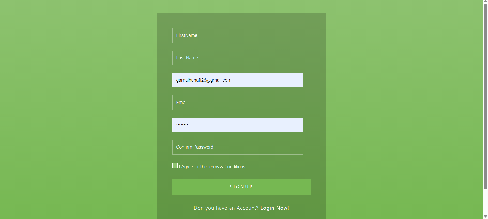
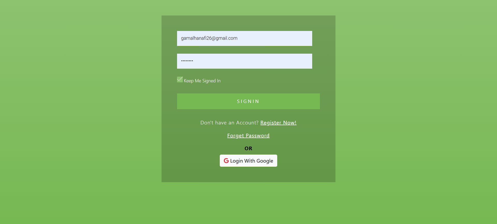

# 🏢 Employee Management System - ASP.NET MVC

A secure and scalable employee management system built with ASP.NET MVC that handles authentication, authorization, and CRUD operations.
## ✨ Key Features

### 🔐 Authentication System
- **Dual Login Options**:
  - Traditional email/password registration
  - Google OAuth integration
- **Password Recovery**:
  - Secure email reset links
  - Token-based validation
### 🏗️ Core Modules
| Module | Features |
|--------|----------|
| **👥 User Management** | View all registered users |
| **👔 Employee Management** | CRUD operations with department assignment |
| **🏛️ Department Management** | Create/edit/delete departments |
| **🎚️ Role Management** | Assign roles via checkbox interface |

## 🛠️ Technical Stack
| Layer | Technologies |
|-------|--------------|
| **Frontend** | Razor Views, Bootstrap 5, jQuery |
| **Backend** | ASP.NET Core MVC, C# |
| **Database** | Entity Framework Core, SQL Server |A
| **Security** | ASP.NET Identity, Role-based Authorization |
| **Services** | SMTP Email, Google Authentication |

## ✨ Enhanced Features

### 🔄 Smart Deletion Handling
| Module | Behavior |
|--------|----------|
| **Role Deletion** | Automatically removes role from all assigned users |
| **Department Deletion** | Cleans up references from all affected employees |

### 🔍 Powerful Search
| Entity | Searchable By |
|--------|--------------|
| Employees |Employee Name |
| Departments |Department Name|
| Roles | Role Name |
| Users |User Name|

### Prerequisites
- .NET 8 SDK
- SQL Server 2019+
- Google Developer Account (for OAuth)

## 🖼️ Visual Walkthrough

    
    
    
    
    
    
    
    
    
    
    
    
    
    
    
    
    
    
    
    
    

## Contact with me

  
  

